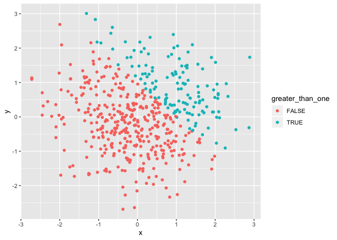
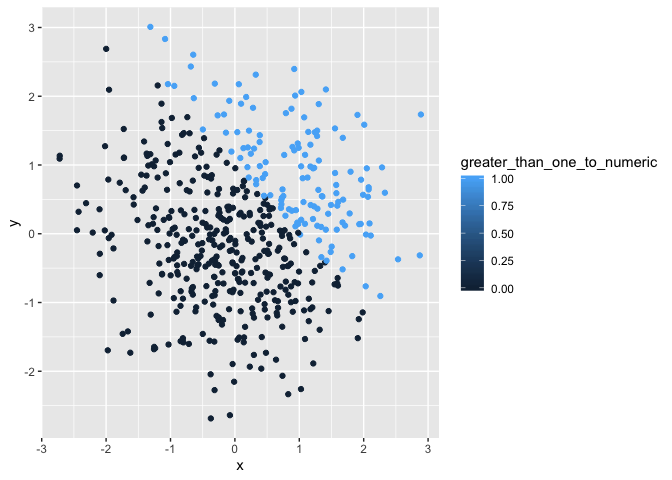
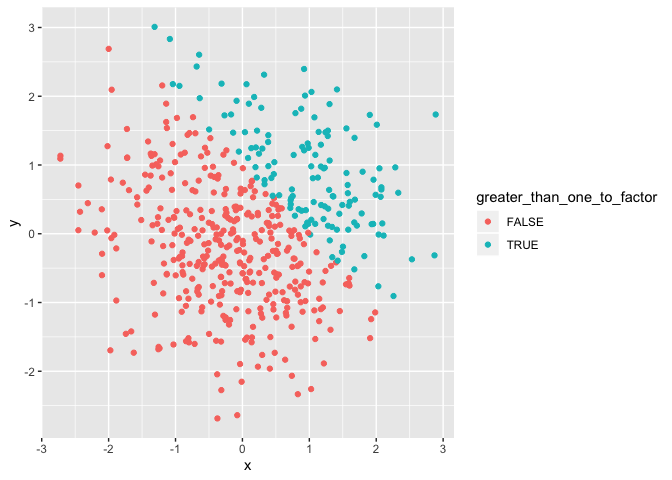

HW 1 for Git upload
================
Katie
9/25/2019

``` r
set.seed(1) 

dataframe_one = tibble(
  random_sample = rnorm(8), 
  logical_vector = random_sample > 0, 
  character_vector = c("I", "sometimes", "like", "to", "eat", "cereal", "for", "dinner"),
  factor_vector = factor(c("low", "medium", "high", "low", "medium", "high", "low", "medium")) 
)

mean_of_random_sample = mean(pull(dataframe_one, random_sample))
mean_of_logical_vector = mean(pull(dataframe_one, logical_vector))
mean_of_character_vector = mean(pull(dataframe_one, character_vector)) ## Error occurred when running this line of code
```

    ## Warning in mean.default(pull(dataframe_one, character_vector)): argument is
    ## not numeric or logical: returning NA

``` r
mean_of_factor_vector = mean(pull(dataframe_one, factor_vector)) ## Error occurred when running this line of code
```

    ## Warning in mean.default(pull(dataframe_one, factor_vector)): argument is
    ## not numeric or logical: returning NA

When trying to take the mean of each variable in our dataframe, it works
for the random\_sample and the logical\_vector. It does not work for the
character\_vector or the factor\_vector.

``` r
as.numeric(pull(dataframe_one, logical_vector))
as.numeric(pull(dataframe_one, character_vector))
as.numeric(pull(dataframe_one, factor_vector))
```

When we apply the as.numeric function to the logical, character, and
factor variables, we are able to turn the logical and factor variables
into numbers. However, we aren’t able to turn the character variables
into numbers.

``` r
logical_to_numeric = tibble(
  to_numeric = as.numeric(pull(dataframe_one, logical_vector)),
  random = pull(dataframe_one, random_sample),
  to_numeric_result = to_numeric * random
)

logical_to_factor = tibble(
  to_factor = as.factor(pull(dataframe_one, logical_vector)),
  random = pull(dataframe_one, random_sample),
  to_factor_result = to_factor * random
) ## Error occurred when running the above code
```

    ## Warning in Ops.factor(to_factor, random): '*' not meaningful for factors

``` r
logical_to_factor_to_numeric = tibble(
  to_factor = as.factor(pull(dataframe_one, logical_vector)),
  factor_to_numeric = as.numeric(to_factor),
  random = pull(dataframe_one, random_sample),
  logical_to_factor_to_numeric_result = factor_to_numeric * random
)
```

``` r
set.seed(2) 

dataframe_two = tibble(
  x = rnorm(500), 
  y = rnorm(500), 
  greater_than_one = x + y > 1, 
  greater_than_one_to_numeric = as.numeric(greater_than_one),
  greater_than_one_to_factor = as.factor(greater_than_one)
)

ggplot(dataframe_two, aes(x = x, y = y, color = greater_than_one)) + geom_point() 
```

<!-- -->

``` r
ggplot(dataframe_two, aes(x = x, y = y, color = greater_than_one_to_numeric)) + geom_point() 
```

<!-- -->

``` r
ggplot(dataframe_two, aes(x = x, y = y, color = greater_than_one_to_factor)) + geom_point() 
```

<!-- -->

  - The **size of the dataset**: 500 rows and 5 columns.
  - The **mean** of x: 0.0616923  
  - The **median** of x: 0.0439172
  - The **standard deviation** of x: 1.0323776
  - The **proportion of cases** for which x + y \> 1: 0.266

Looking at the scatterplot of y vs x with the colored logical, numeric,
and factor variable points, we see that there is a distinct divide in
color that arises in a similar fashion for all three graphs. The
uppermost right portion of the graphs are a different color compared to
the bottom lefthand area. There seems to be an invisible line of slope
-1 that follows the equation y = -x + 1 where anything to the top of
that line is one color, and anything to the bottom of that graph is a
different color.
